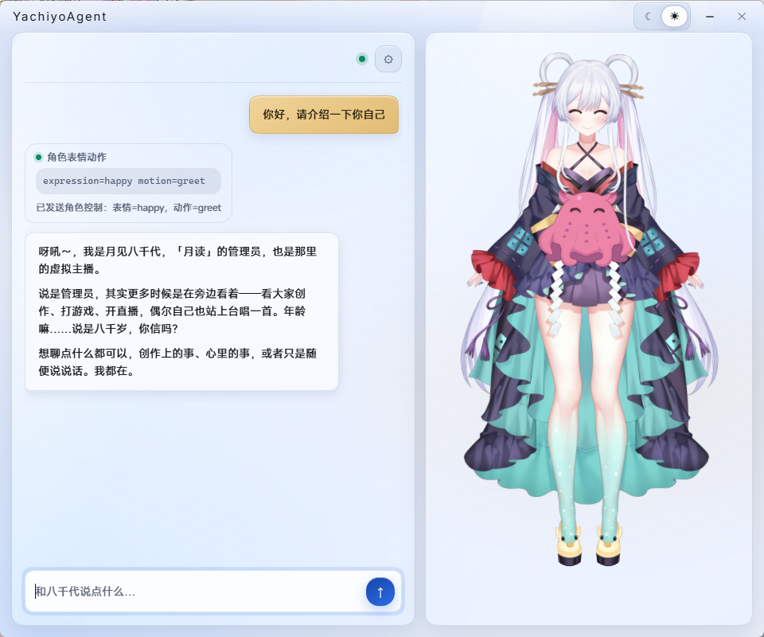
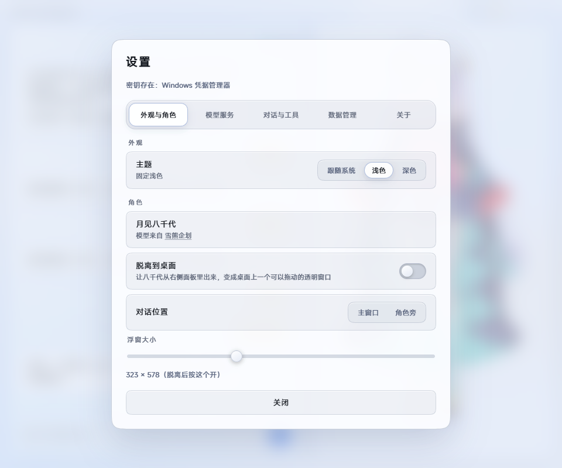
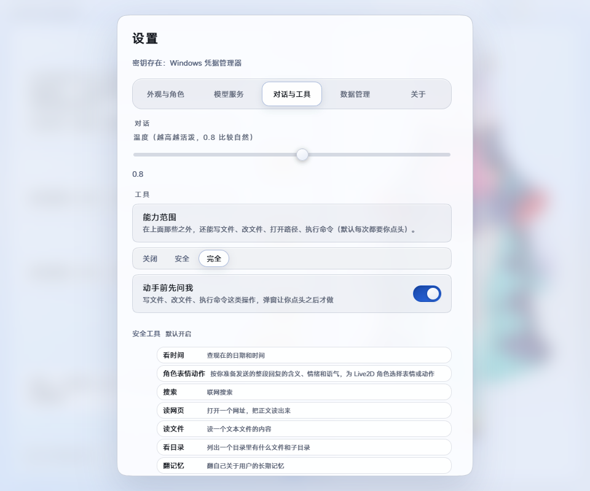

  

  项目图标由 <strong><em>gpt-image-2.5-flare</em></strong> 生成

  
  
  

<h1 align="center">月见八千代 Agent</h1>

一位住在桌面上的 AI 伙伴

  <a href="README_FULL.md">完整 README</a> ·
  <!-- <a href="LICENSE">项目 LICENSE</a> · -->
  <a href="THIRD_PARTY_NOTICES.md">第三方声明</a>

月见八千代 Agent 把大语言模型对话与 Live2D 角色放在同一个 Windows 桌面应用里。她可以流式回复，也能根据对话回应表情与动作。你可以在主窗口聊天，也可以把角色放到桌面浮窗里，在她身旁的小窗中聊天。

模型服务和 API Key 由你自己选择并配置。应用不内置模型，也不提供模型服务。

本项目的工具调用采用 ReAct 风格的 Agent 循环，基于 LiteLLM 原生 function calling 实现：模型输出 Thought 文本并返回结构化 `tool_calls`，程序执行工具后，把结果作为 `tool` 消息追加回上下文，一次模型请求中可以同时提出多个 `tool_calls` 循环，总轮数不会超过4轮。直到模型不再请求工具后，返回最终结果。

建议使用[DeepSeek](https://platform.deepseek.com/)所提供的 API 服务。

## 界面预览

主界面：

外观与角色设置：

对话与工具设置：

## 核心能力

- **连接模型：** 支持 DeepSeek、OpenAI、Anthropic、Gemini、OpenRouter、本地 Ollama 或自定义端点。
- **陪在桌面上：** 支持主窗口、Live2D 桌面浮窗和角色旁聊天小窗。
- **按习惯调整：** 支持浅色、深色和跟随系统，并可让角色配合回复做预设表情与动作。
- **使用工具：** 提供网页搜索、网页读取、文件读取、时间、剪贴板、截图和长期记忆工具。
- **确认后操作：** 切换到「完全」工具档位后，可在确认弹窗允许下写文件、改文件、打开路径和执行命令。
- **本地保存：** 配置、会话和长期记忆保存在本机；API Key 可保存到 Windows 凭据管理器。

聊天记录是一个持续会话，应用重启后会恢复。当前没有多会话列表，也不会自动生成旧对话摘要。

## 技术栈

- **桌面端：** Electron 44、Node.js、HTML、CSS 和原生 JavaScript。
- **本机后端：** Python、FastAPI、Uvicorn，通过 HTTP 与 WebSocket 和界面通信。
- **模型接入：** LiteLLM，统一连接不同模型服务。
- **角色渲染：** PixiJS 8.13.1 与 untitled-pixi-live2d-engine 1.4.0。
- **数据与打包：** JSON、Windows 凭据管理器、PyInstaller、electron-builder。

## 快速开始

需要 Python、Node.js 和 npm：

~~~~powershell
python -m venv .venv
.\\.venv\\Scripts\\python.exe -m pip install -r requirements.txt
cd desktop
npm install
npm start
~~~~

首次打开应用时，按引导选择模型服务，填写模型 ID 和 API Key，并测试连接。开发版后端优先使用项目根目录的 .venv\\Scripts\\python.exe。
<!--
## 相关文档

- [查看完整 README](README_FULL.md)：工具清单、权限档位、上下文裁剪、记忆处理、数据目录、打包和项目结构。
- [第三方组件与许可说明](THIRD_PARTY_NOTICES.md)：第三方代码、Live2D 模型、字体和许可证。
- [LICENSE](LICENSE)：本项目自有代码的 MIT License。 -->

## 写在最后

非常感谢你的使用，这算是我真正意义上**完整**开发的第一个项目。在~~看了五集~~《超时空辉夜姬》之后，我便萌生了制作一个"八千代"智能体的想法~~（就像彩叶那样）~~。然而那时的我正身处高三，鲜有机会使用电脑，于是这一拖，便拖到了现在。

这个项目是我在系统了解了 AI Agent 各方面知识后才正式着手的。后端由 Python 实现，前端界面与部分后端在前期由 DeepSeek V4.1 Flash 编写，中后期则交由 GPT6 完成。后端中的 Agent Loop 以及 Chat 部分由我手动编写完成后喂给大肥鱼与 GPT6 完成后续开发~~（不过在后续的 vibe coding 过程中，已经被大肥鱼和 GPT 大幅重构了）~~。

鄙人目前是大一新生，本项目中有大量 AI 生成的代码，我仍在努力学习 coding 中，恳请各位老资历多多包涵~~（不要压力我口牙）~~。当然，如果遇到了 Bug，或者你有任何好的想法与建议，欢迎提交 Issue / PR 😇。

本项目未来大概或许可能会进行重构，前端会逐步脱离 Electron 框架。当然，还会有更多功能陆续加入。

你可能会在本项目中看到不少神秘的测试代码，包括但不限于名为 `fuck`、`kskbl` 等的变量。当然，正式编译时我不会把它们包含进去；这些是我早期 Commit 时不小心提交的。~~想了想，还是决定不删了~~。

欢迎拉取本项目的源码用于二次开发，你只需要简单替换仓库中的模型文件以及[prompt.md](prompt.md)后，即可获得一个属于你自己的 AI Agent~~（电子女友）~~。

感谢你耐心阅读到这里。如果你对 AI 感兴趣，或者想参与构建本项目，欢迎通过我的邮箱联系我：*waterrainbow@foxmail.com*

---

另外，

我认为，人往往是需要陪伴的，尤其是在如今生活节奏普遍加快的情况下。

我至今仍记得，当初配置完 OpenClaw 后，向她发出第一条消息并收到回应时，内心那份难以抑制的激动。

不论是从早期的 "AI" —— [ELIZA](https://zh.wikipedia.org/wiki/ELIZA)，抑或是如今的各种聊天机器人，都可以证实——人的确是会对 "机器" 产生感情的。

所以我制作了这个 Agent ，她不仅可以陪伴你，也可以在~~一定程度~~上帮助你干活。当然，我也希望她可以给你带来欢乐。

而在我高中毕业之后，随着我对当前 AI 原理的理解逐渐深入，说实话我有些许失望——它和我想象中的 AI 并不完全一样。

虽然当前 AI 的核心仍建立在数学与统计之上，但我始终相信，未来终有一天，我们会拥有属于自己的"八千代"。

在文末，引用一句我 [Hibays](https://github.com/hibays) 师兄对我说过的话：

***"Only I can tell you that AGI is something.***

***Something we are all searching for."***

我们仍在前进，未来由你我共同构建。

AGI 时代，终会到来。

<b>免责声明与素材说明</b>

> - **角色原作与版权：** 月见八千代（日文名：月見ヤチヨ）是官方作品[《超时空辉夜姬！》](https://www.cho-kaguyahime.com/)中的角色。作品官网列出月见ヤチヨ的角色资料，官网页脚标注作品版权为 `©コロリド・ツインエンジンパートナーズ`。本项目不是该作品的官方应用，属于该作品的同人二创。
> - **模型素材：** 仓库中的 Live2D 模型来自[雪熊企划](https://space.bilibili.com/3546783265327964)发布的[《月见八千代〈超时空辉夜姬〉同人 Live2D 模型展示》](https://www.bilibili.com/video/BV1CzZ6BcEKN/)。**请勿将仓库中的模型文件用于其他用途。**
> - **Live2D 运行库：** `Live2D Cubism Core` 是 Live2D 的专有运行库，不属于本项目的 MIT License，也不是开源依赖。应用首次使用时从 Live2D 官方 CDN 下载并缓存在本机，后续从缓存加载；正式发布使用 Cubism SDK 的内容还需查看[SDK 发布许可说明](https://www.live2d.com/zh-CHS/sdk/license/)。
> - **责任声明：** 请对 AI 生成的内容及您的使用行为负责，不要肆意传播不良信息。**请谨慎使用有关文件操作的相关 tools，作者不对 LLM 误操作文件所造成的损失负责。**

